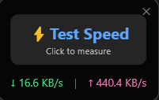
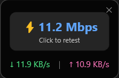

# Throughput - User Documentation

> **Version:** 1.0.0  
> **Platform:** Windows 10/11 (x64)  
> **License:** MIT

---

## Table of Contents

1. [Introduction](#introduction)
2. [Installation](#installation)
3. [User Interface](#user-interface)
4. [Features](#features)
   - [Real-time Network Speed](#real-time-network-speed)
   - [Speed Test](#speed-test)
5. [Controls](#controls)
6. [Configuration](#configuration)
7. [Technical Reference](#technical-reference)
8. [Troubleshooting](#troubleshooting)
9. [FAQ](#faq)

---

## Introduction

**Throughput** is a lightweight Windows utility that displays real-time network speed as an always-on-top overlay widget. It's designed to be minimal, performant, and non-intrusive—similar to how smartphones display network speed in the status bar.

### Key Highlights

| Feature | Description |
|---------|-------------|
| Real-time monitoring | Updates every 1 second |
| Speed test | One-click bandwidth measurement |
| Portable | No installation required |
| Lightweight | ~70 MB self-contained executable |
| Privacy-focused | No telemetry, no analytics |

---

## Installation

### Option 1: Download Pre-built Executable

1. Download `Throughput.exe` from the [Releases](https://github.com/HakkanShah/Throughput/releases) page
2. Place it anywhere on your system
3. Double-click to run

### Option 2: Build from Source

```powershell
# Clone repository
git clone https://github.com/HakkanShah/Throughput.git
cd Throughput

# Build and run
dotnet build
dotnet run

# Create self-contained executable
dotnet publish -c Release -r win-x64 --self-contained true -p:PublishSingleFile=true -o ./publish
```

---

## User Interface

<table align="center">
  <tr>
    <td align="center"><br/><em>Before Speed Test</em></td>
    <td align="center"><br/><em>After Speed Test</em></td>
  </tr>
</table>

### UI Elements

| Element | Description |
|---------|-------------|
| ✕ | Close button (exits application) |
| ⚡ Speed | Last speed test result (click to test) |
| Subtext | Status message / Click to retest |
| ↓ | Real-time download speed |
| ↑ | Real-time upload speed |

---

## Features

### Real-time Network Speed

The widget displays live download and upload speeds:

- **Download (↓)** - Current incoming data rate
- **Upload (↑)** - Current outgoing data rate

Speed units automatically scale:
- `B/s` → Bytes per second
- `KB/s` → Kilobytes per second
- `MB/s` → Megabytes per second
- `GB/s` → Gigabytes per second

**Data Source:** Windows Performance Counters (`Network Interface` category)

### Speed Test

Click the "⚡ Test Speed" button to measure your internet bandwidth:

1. Click anywhere on the speed test area
2. Wait while "Testing..." appears
3. Result displays in **Mbps** (megabits per second)
4. Click "Click to retest" to run again

**Test Methodology:**
- Downloads ~10 MB from CDN servers
- Calculates average throughput
- No data is uploaded during test

**CDN Servers Used:**
- Cloudflare Speed Test
- OVH Proof Servers
- Tele2 Speed Test

---

## Controls

| Action | How To |
|--------|--------|
| **Move widget** | Click and drag anywhere (except buttons) |
| **Run speed test** | Click on "⚡ Test Speed" or speed result |
| **Close application** | Click ✕ button OR right-click tray → Exit |
| **Show window** | Double-click system tray icon |

### Cursor Indicators

| Cursor | Meaning |
|--------|---------|
| Move arrows (✥) | Draggable area |
| Hand pointer (👆) | Clickable element |

---

## Configuration

### Auto-start with Windows

**Method 1: Startup Folder (Recommended)**
1. Press `Win + R`
2. Type `shell:startup` → Enter
3. Create a shortcut to `Throughput.exe`

**Method 2: Registry**
```powershell
$exePath = "C:\Path\To\Throughput.exe"
New-ItemProperty -Path "HKCU:\Software\Microsoft\Windows\CurrentVersion\Run" `
    -Name "Throughput" -Value $exePath -PropertyType String -Force
```

**Remove from Startup:**
```powershell
Remove-ItemProperty -Path "HKCU:\Software\Microsoft\Windows\CurrentVersion\Run" -Name "Throughput"
```

---

## Technical Reference

### System Requirements

| Requirement | Value |
|-------------|-------|
| Operating System | Windows 10 / Windows 11 |
| Architecture | x64 (64-bit) |
| .NET Runtime | Not required (self-contained) |
| Disk Space | ~70 MB |
| RAM | ~30 MB |

### Data Sources

| Metric | Performance Counter |
|--------|---------------------|
| Download speed | `Network Interface` → `Bytes Received/sec` |
| Upload speed | `Network Interface` → `Bytes Sent/sec` |

### Network Adapter Selection

The application automatically selects the active network adapter by:
1. Filtering out loopback interfaces
2. Filtering out tunnel interfaces
3. Filtering out virtual adapters
4. Selecting the first operational interface

Adapter is re-checked every 30 seconds.

---

## Troubleshooting

### Widget shows 0 B/s constantly

**Cause:** No active network adapter detected  
**Solution:** 
- Ensure you have an active internet connection
- Check if your network adapter is enabled
- Restart the application

### Speed test shows "Test failed"

**Cause:** Cannot reach CDN servers  
**Solution:**
- Check your internet connection
- Firewall may be blocking outbound connections
- Try again later (server may be temporarily unavailable)

### Widget appears off-screen

**Cause:** Window position saved outside visible area  
**Solution:**
1. Look for the tray icon in the system tray
2. Double-click to bring window to focus
3. Restart the application

### High CPU usage

**Cause:** Should not happen under normal circumstances  
**Solution:**
- Ensure you're running the latest version
- Report issue on GitHub with system details

---

## FAQ

**Q: Does Throughput use the internet?**  
A: Real-time monitoring uses NO internet. Speed test requires internet to download test files.

**Q: Is my data sent anywhere?**  
A: No. There is no telemetry, analytics, or data collection.

**Q: Can I customize the UI?**  
A: Not currently. Future versions may include themes.

**Q: Why is the executable 70 MB?**  
A: It includes the entire .NET runtime so users don't need to install anything.

**Q: Does it work on Windows 7/8?**  
A: Not officially supported. Windows 10+ only.

---

## Support

- **Issues:** [GitHub Issues](https://github.com/HakkanShah/Throughput/issues)
- **Source Code:** [GitHub Repository](https://github.com/HakkanShah/Throughput)

---

<p align="center">
  Crafted with by <a href="https://hakkan.is-a.dev">Hakkan</a>
</p>

*Last updated: December 2025*
